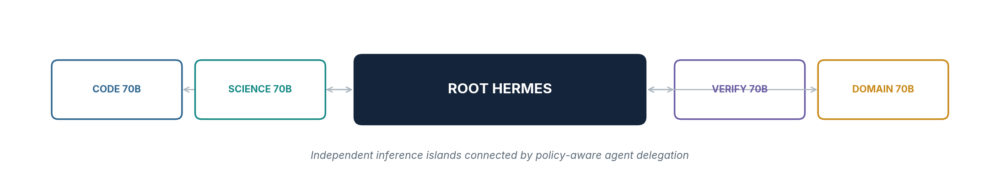
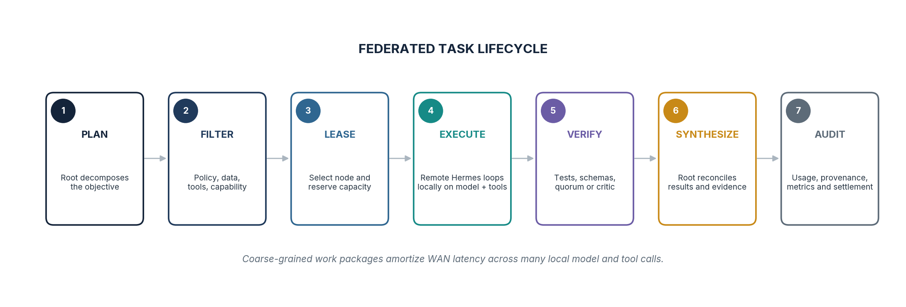
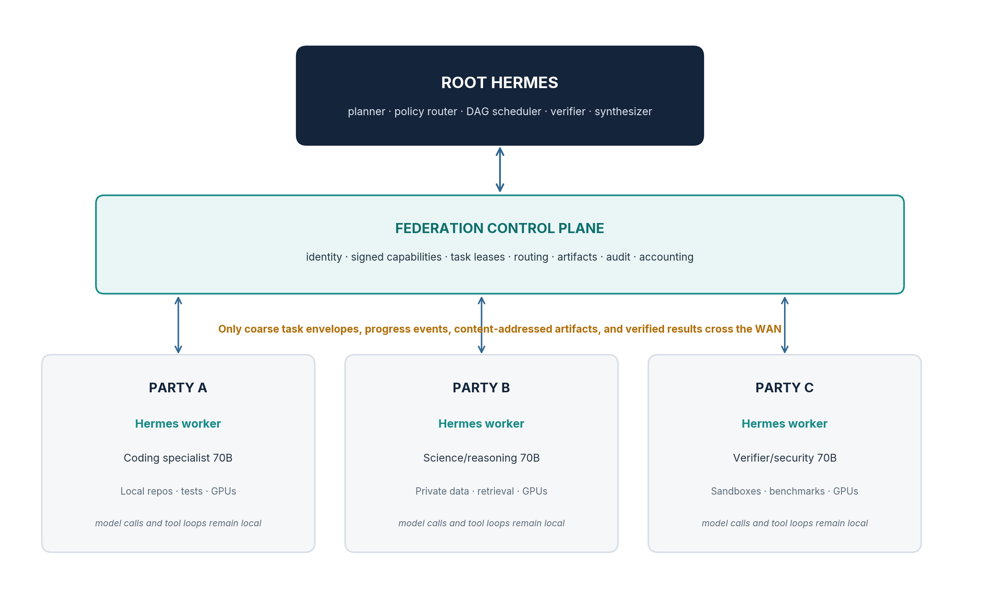

**PRODUCT REQUIREMENTS DOCUMENT**

# Consign

An open protocol for delegating agent work packages across organizational boundaries

Working product definition · Version 0.2 · 10 August 2026



*Task-level federation: complete local models collaborate through agent work packages rather than token-level WAN parallelism.*

> **Product thesis**
> Ship tasks, not tokens. Each participant keeps its model, tools, data, and inner agent loop local; the federation exchanges only scoped work packages, progress, artifacts, evidence, and verified outcomes.

> **Naming placeholder**
> **CONSIGN** is a working name, chosen because a consignment is a sealed package with a manifest, a chain of custody, an attenuating authority to act on it, and a signed receipt — which is precisely this protocol's object model. It is a single find-and-replace away from whatever you settle on. The v0.1 name *Hermes Federation* was retired in v0.2 because the node runtime is now agent-runtime-agnostic (D8) and Hermes is one adapter, not the product; continuing to use another project's name for something they do not govern was a liability rather than an asset.

| **STATUS**<br>**Draft for design review** | **DELIVERABLE**<br>**Open protocol + reference node + conformance suite** | **PRIMARY OWNER**<br>**TBD** |
| --- | --- | --- |

## 0 Document control

|  |  |
| --- | --- |
| **Product** | Consign (working name; formerly *Hermes Federation*) |
| **Document** | Product Requirements Document |
| **Version** | 0.2 |
| **Status** | Draft for architecture, security, and implementer review |
| **Date** | 10 August 2026 |
| **Primary audience** | Protocol implementers, platform engineers, model operators, security reviewers, node operators |
| **Implementation basis** | A standalone Go node daemon implementing a published extension profile of **A2A v1.0**. Agent runtimes attach through a thin worker-adapter interface; `hermes-agent` is adapter #1, not the substrate. |
| **Delivery boundary** | Two independently operated nodes exchanging one deterministic task contract, plus a runnable conformance suite |
| **Companion document** | `spec/consign-profile-v0.1.md` — the normative wire specification |

### Revision history

| **Version** | **Date** | **Change** | **Owner** |
| --- | --- | --- | --- |
| **0.1** | 10 Aug 2026 | Initial product definition for agent-level federation | TBD |
| **0.2** | 10 Aug 2026 | Thirty architecture decisions resolved (Appendix A.5). Product repositioned from a Hermes consortium pilot to an open A2A profile with a runtime-agnostic node daemon. Identity moved to did:web; delegation made recursive under attenuable capability tokens; verification narrowed to deterministic-only; money removed from scope; §7.3, §8.5, §9.1, §13 and §14 rewritten. | TBD |

### Contents

| **Section map** | **Section map** |
| --- | --- |
| 1 Executive summary | 2 Problem and opportunity |
| 3 Vision, principles, goals, and non-goals | 4 Users, stakeholders, and core use cases |
| 5 Product experience and task lifecycle | 6 Functional requirements |
| 7 System architecture | 8 Protocol and data model |
| 9 Routing and orchestration | 10 Security, privacy, and trust |
| 11 Non-functional requirements | 12 Metrics and evaluation |
| 13 Delivery plan | 14 Acceptance plan |
| 15 Risks and mitigations | 16 Residual open decisions |
| A Appendices |   |

### Reading this version

Requirement tables carry a **Δ** column. `=` is unchanged from v0.1, `~` is materially changed, `+` is new in v0.2, and `−` marks a v0.1 requirement that was withdrawn with its reason. Decisions are referenced as **D1**–**D30** and are listed in full in Appendix A.5.

## 1 Executive summary

Consign is an open protocol, published as an extension profile of **A2A v1.0**, that lets independently operated organizations delegate substantial agent work packages to one another without pooling GPUs, centralizing data, or agreeing on a shared agent runtime. It ships with a reference node daemon, a Hermes worker adapter, and a conformance suite that any implementer can run against their own endpoint.

Each participant operates a complete local inference island: a node daemon, one or more locally resident specialist models, approved tools, private data connectors, and local sandboxes. A task originator decomposes an objective into coarse work packages, routes each package to a capable participant under an attenuable capability token, verifies returned artifacts deterministically, and synthesizes the final result. Any node can originate; there is no permanent root and no central operator.

> **Decisive architecture choice**
> Consign is agent-level federation, not federated learning and not WAN tensor parallelism. Remote nodes receive substantial autonomous work packages and complete many local model and tool calls before returning a result.

### The five choices that define the product

| **Choice** | **What it means** | **Decision** |
| --- | --- | --- |
| **Open protocol, not a consortium** | The deliverable is a spec plus reference implementation. Adopters onboard alone, with no membership process and no central authority to petition. | D2 |
| **Profile of A2A v1.0, not a new protocol** | Transport, task, message, and artifact semantics are inherited. Consign contributes declared extensions for constraints, delegation authority, budgets, verification, artifacts, and receipts. | D4 |
| **Identity anchored in DNS** | An organization *is* a domain. Keys are published as a did:web document; there is no CA to join and nobody to ask for permission. | D5 |
| **Authority attenuates, never widens** | Every delegation carries a capability token that a downstream node verifies back to the originator's key. A node cannot grant what it was not given. | D18 |
| **Verified means reproducible** | v1 federates only work whose output can be checked deterministically. Everything else is labelled `UNVERIFIED` and treated as such. | D14 |

### MVP in one view

| **Dimension** | **MVP definition** |
| --- | --- |
| **Topology** | Two independently operated nodes; symmetric — either may originate |
| **Local stack** | Consign node daemon + worker adapter + OpenAI-compatible local inference server + local tools |
| **Wire contract** | mTLS + A2A v1.0 JSON-RPC/SSE with the Consign extension set |
| **Delegation unit** | Coarse task fulfilling a versioned task contract, not a model layer, expert, activation, or token |
| **Trust posture** | Identity is DNS-anchored, authority is attenuable, execution is sandboxed by the daemon, results are untrusted until deterministically verified |
| **Proof point** | One task contract (code review with patch and test evidence) runs across two organizations, survives node failure, refuses an out-of-policy tool, and passes the conformance suite |

### Expected value

- Make agentic workloads feasible when a single organization cannot host all required models or parallel branches.
- Exploit heterogeneous specialization: coding, scientific reasoning, security review, domain retrieval, simulation, and verification.
- Keep private tools and datasets at the organization that owns them; move the task to the data rather than centralizing the data.
- Amortize WAN latency across many local inference and tool steps by delegating self-contained work packages.
- Improve reliability through deterministic tests, result schemas, and provenance rather than self-reported confidence.

> **What v0.1 will and will not demonstrate**
> Section 3 keeps three value pillars — capacity, specialization, and data sovereignty — as co-equal product goals (D1). The first release proves only the third-party-verified **coding and review** pillar end to end (D27). Capacity and sovereignty are architecturally supported and roadmapped, not evidenced. This document says so rather than letting a reviewer discover it.

## 2 Problem and opportunity

### 2.1 Current constraint

A single 4×A6000 or similar laboratory setup is often unable to provide practical interactive serving for a large 70B-class model at the context sizes, batch sizes, and concurrency demanded by advanced agent workflows. The constraint becomes more severe when an agent must make many sequential model calls, run parallel investigations, invoke tools, recover from errors, and ask a verifier to independently inspect the result.

At the same time, neighboring laboratories, companies, or consortium members may each possess an 8-GPU box that can host a complete specialist model. Their capacity is fragmented by administrative boundaries, security policies, data residency, incompatible schedulers, and the absence of a shared agent task protocol.

### 2.2 The honest alternative

Capacity alone is a weak argument in 2026: hosted inference is elastic, cheap, and one configuration line away in every agent runtime. A reviewer will raise this immediately, so the product states its own boundary:

| **If the need is…** | **The right answer is…** |
| --- | --- |
| More tokens per second of a general model | Rent hosted inference. Consign adds latency and governance for no gain. |
| A specialist model or tool environment somebody else owns and will not export | Consign |
| Computation over data that may not leave its owner's premises | Consign — no hosted vendor can do this at any price |
| Many long-running agent branches, where local queueing is the bottleneck and peers have idle capacity | Consign, provided the work packages are coarse |

### 2.3 Why cluster-style distribution is insufficient

| **Approach** | **Primary unit of distribution** | **WAN consequence** | **Product decision** |
| --- | --- | --- | --- |
| **Tensor / pipeline parallelism** | Layers, tensor shards, activations, token-step synchronization | Frequent latency-sensitive communication; tightly coupled failure domain | Remain inside a participant site or datacenter |
| **Expert-parallel MoE serving** | Experts and routed hidden states | Per-token routing and large model-state footprint across sites | Out of scope |
| **Request routing** | Whole model request to one replica | Useful for replicated models, but does not exploit heterogeneous specialists | Supported as a lower-level optimization |
| **Agent-level federation** | Task, subagent, artifact, evidence, and verification stage | Coarse messages; local loops hide WAN latency | Core product architecture |

### 2.4 Product opportunity

The opportunity is to turn fragmented model installations into a governed inference mesh in which any node can originate a task and delegate substantial work to others. Because there is no consortium to join (D2), the addressable set is every organization that can publish a DNS record and run one binary.

> **Core scaling property**
> A remote coding node may perform 20 model calls and 40 local tool calls while the federation carries one task submission, a small stream of progress events, and one signed result bundle.

## 3 Vision, principles, goals, and non-goals

### 3.1 Vision

Any organization that controls a domain name should be able to run one binary, publish what it can do, discover trusted peers, delegate high-value work to them under bounded authority, verify what comes back, and synthesize a result — without a shared supercomputer, a shared data lake, a shared model vendor, or anybody's permission.

### 3.2 Product principles

- **Ship tasks, not tokens.** Use coarse, autonomous work packages as the federation boundary.
- **Models stay complete.** A participant owns the local serving topology and keeps model-internal synchronization within its site.
- **Data stays where policy requires.** Route computation to private data and return minimized, approved outputs.
- **Evidence outranks confidence.** Prefer tests, schemas, citations, hashes, provenance, and independent validators.
- **Untrusted by default.** Authenticate every party, constrain every task, sandbox execution, and verify every result.
- **Trust is bilateral, never transitive.** *(new in v0.2, D18)* A trusts B and B trusts C never implies A trusts C. Discovery is a hint; eligibility is always the originator's own decision.
- **Authority attenuates.** *(new in v0.2, D18)* A delegated token may only be narrowed. Any downstream node can verify the chain back to the originator without asking anyone.
- **Say what you can enforce.** *(new in v0.2, D19)* Claims the protocol cannot check are labelled `declared`, never presented as controls.
- **Side effects remain originator-controlled.** Remote agents propose changes; the originator or an approved executor authorizes consequential actions.
- **Open and pluggable.** Support heterogeneous model servers, tools, organizations, and agent runtimes behind a stable task contract.
- **Graceful degradation.** A failed participant should reduce capacity, not corrupt the whole agent workflow.

### 3.3 Goals

| **ID** | **Goal** | **Δ** |
| --- | --- | --- |
| **G1** | Publish an A2A-conformant profile that lets any node delegate bounded work packages to any other. | ~ |
| **G2** | Run multiple specialized 70B-class models concurrently as one task graph. | = |
| **G3** | Keep inner model calls, tool calls, sandboxes, and private data access local to each participant. | = |
| **G4** | Provide discovery, eligibility filtering, admission, progress, cancellation, retry, and failure recovery with no central service. | ~ |
| **G5** | Return structured artifacts and evidence that can be deterministically verified before synthesis or execution. | ~ |
| **G6** | Provide end-to-end auditability, usage accounting, quotas, and operational observability. | = |
| **G7** | Keep the node daemon runtime-agnostic so any agent framework can participate through a thin adapter. | + |
| **G8** | Make onboarding a single binary, a config file, and a DNS record. | + |

### 3.4 Non-goals

- Reproduce the exact forward pass or capabilities of one monolithic model such as a very large MoE system.
- Perform tensor, pipeline, expert, or KV-cache parallelism across ordinary wide-area links.
- Implement federated model training, weight aggregation, or privacy-preserving learning.
- Centralize participant datasets, memory stores, secrets, or raw agent trajectories.
- Require participants to reveal hidden reasoning or chain-of-thought. The protocol requests concise rationale and verifiable evidence only.
- **Settle payments, issue credits, or operate a marketplace.** *(D13)* Money is out of scope for v1. The protocol carries co-signed receipts over externally observable units so that a settlement layer — most plausibly A2A's `x402` extension — can be added later without a breaking change, but no v1 component prices, bills, or transfers anything.
- **Assert quality claims the protocol cannot verify.** *(D19)* Model identity, GPU-hours, and token counts are recorded as declared provenance, never as measured guarantees.
- Allow a remote participant to perform consequential external side effects without explicit policy and approval.

## 4 Users, stakeholders, and core use cases

### 4.1 Personas

| **Persona** | **Primary need** | **Success definition** | **Δ** |
| --- | --- | --- | --- |
| **Task originator** | Complete a task that exceeds local model capacity or needs multiple specialists | Can launch, observe, steer, verify, and synthesize a federated run from one session | = |
| **Node operator** | Contribute controlled capacity without surrendering local autonomy | Can advertise capabilities, set quotas and policies, inspect tasks, and revoke access | = |
| **Research / engineering lead** | Use several models and tool environments as one reproducible workflow | Gets better verified outcomes or faster completion than the best local-only baseline | = |
| **Security and compliance reviewer** | Prove that data and side effects obey organizational policy | Has immutable identity, policy, provenance, and artifact audit records | = |
| **Protocol implementer** | Build a conformant node or adapter in another language or runtime | Passes the published conformance profiles without reading the reference source | + |
| **Anchor operator** | Contribute large compute and optional infrastructure roles | Can serve high concurrency, publish an index, and relay for firewalled peers under a declared SLA | + |
| **Hosted organization** | Participate under its own identity without owning GPUs | Runs models on an anchor's hardware with the hosting relationship disclosed on the wire | + |

### 4.2 Core user stories

- As an originator, I can delegate when the task is too large, too parallel, or too specialized for my local node.
- As an originator, I can restrict delegation to approved organizations, data regions, tools, model families, and budget limits — and know that a node two hops away cannot exceed them.
- As a node operator, I can advertise measured capabilities and current capacity without exposing model weights, prompts, or private datasets.
- As a node operator, I can reject tasks that violate local policy and give a machine-readable reason.
- As a security reviewer, I can trace which organization, model manifest, tools, and artifacts contributed to the final answer, and see which of those facts were verified versus declared.
- As an implementer, I can build a conformant node from the spec alone and prove it with the conformance suite.
- As a hosted organization, I can participate under my own identity while every counterparty can see who my host is before sending me anything.
- As anyone, I can originate a task without registering with, paying, or being approved by any central party.

### 4.3 Priority use cases

| **Use case** | **Federated pattern** | **Verifiability class** | **In v0.1?** |
| --- | --- | --- | --- |
| **Distributed software engineering** | Planner → implementer → independent reviewer → test verifier | `DETERMINISTIC` | **Yes** |
| **Multi-model verification** | Two independent proposals plus deterministic adjudication | `DETERMINISTIC` | Phase 3 |
| **Data-sovereign analysis** | Originator ships deterministic **code plus output schema**; owner executes; only schema-valid results return | `DETERMINISTIC` by construction (D15) | Phase 4 |
| **Batch agent workloads** | DAG fan-out across available participant capacity | Inherited from the contract | Phase 3 |
| **Scientific research and simulation** | Parallel literature, math, simulation, and critique branches | Largely `UNVERIFIED` | Post-v1 |

> **How data-sovereign work stays honest (D15)**
> v0.1's verification stance is deterministic-only, and an originator who cannot see the input data cannot reproduce a computation over it. The resolution is to change the shape of the request: for `LOCAL-ONLY` work the originator sends a program and a strict output schema rather than a prose goal. The remote agent may *write* that program, but the program is the artifact under review, its digest is in the provenance, and the returned values are schema-validated, range-checked, and aggregate-checked. What is trusted is a reviewable program, not a model's assurance.

## 5 Product experience and task lifecycle



*Figure 1. The federation boundary surrounds complete remote work packages, not individual inference steps.*
**Stale asset — regenerate.** This diagram still shows the v0.1 two-phase offer/lease handshake, which was removed in v0.2 (D21).

### 5.1 Originator flow

1. The operator starts a normal agent session and requests delegation explicitly or through an approved policy.
2. The agent decomposes the objective into a task graph. Each node names a **task contract** — a versioned input/output schema identifier — rather than a free-text capability (D16).
3. The node daemon filters candidates: did:web verification, bilateral allowlist, contract support, accepted data classes, hosted-by union, and capacity freshness. Ineligible peers are removed before any content is composed (D17, D10b).
4. The daemon **submits the task in one call** (D21). The envelope carries constraints, budgets, an attenuable capability token, and artifact *references* — never plaintext payloads. A refusal therefore costs a round trip and reveals nothing.
5. On acceptance the participant returns a capacity lease and a stream cursor. The originator issues artifact **grants** scoped to that participant only after acceptance.
6. The remote node daemon creates a sandbox, launches its worker adapter inside it, and the worker runs its own agent loop, model calls, tools, and data access locally.
7. Progress arrives as a sequence-numbered event stream that can be resumed from a cursor after any disconnect (D7).
8. The originator pins every artifact it depends on, runs the contract's deterministic validators in its own sandbox, and either accepts, requests targeted correction, or reroutes.
9. Both sides co-sign a receipt over externally observable units and append it to their audit chains.

### 5.2 Node onboarding flow

1. Publish a did:web document at `https://<org-domain>/.well-known/did.json` containing the organization signing key.
2. Install the node daemon; it obtains a WebPKI certificate for its endpoint on that domain and generates a node key signed by the organization key.
3. Publish a signed Agent Card at `/.well-known/agent-card.json` declaring supported task contracts, tools, data classes, capacity, participation tier, and — if hosted — the `hosted_by` organization.
4. Optionally submit the card to one or more indexes. Indexes are conveniences, not gatekeepers: every consumer re-verifies against did:web before the card becomes eligible (D17).
5. Configure bilateral allowlists and quotas. Run the conformance suite against your own endpoint.
6. Receive tasks. There is no approval queue and no membership committee.

### 5.3 Task states

| **State** | **Meaning** | **Terminal?** | **Δ** |
| --- | --- | --- | --- |
| **CREATED** | Task graph node exists locally but has not been submitted | No | = |
| **SUBMITTED** | Envelope sent; acceptance not yet received | No | + |
| **ACCEPTED** | Participant accepted, lease issued, artifact grants released | No | ~ |
| **RUNNING** | Remote worker is actively executing the work package | No | = |
| **VERIFYING** | Deterministic validators are running, in the originator's sandbox | No | ~ |
| **COMPLETED** | Accepted result is available to the parent workflow | Yes | = |
| **PARTIAL** | Useful artifacts exist, but acceptance criteria were not fully met | Yes | = |
| **FAILED** | Execution failed without ambiguity about external side effects | Yes | = |
| **CANCELLED** | Cancellation was acknowledged and execution stopped | Yes | = |
| **UNKNOWN** | Owner disappeared or side effects cannot be proven; automatic retry is unsafe | Yes | = |

> **OFFERED removed (D21).** v0.1 used a two-phase offer/lease handshake so that protected content never reached a node that would refuse. Once context became references-only (D6) the first message carries nothing worth protecting, so the state, the round trip, and a bespoke extension all disappeared. Capacity reservation survives as a lease returned *with* acceptance.

## 6 Functional requirements

Priorities use Must, Should, and Could. Must requirements define the acceptance boundary.

### 6.1 Identity, membership, and policy

| **ID** | **Δ** | **Priority** | **Requirement** | **Acceptance signal** |
| --- | --- | --- | --- | --- |
| **FR-001** | ~ | **MUST** | Anchor organization identity in a did:web document at the organization's domain; authenticate transport with mTLS whose certificate binds to that same domain. | A node presenting a certificate whose domain does not match its claimed organization identity is rejected before any task content is composed. |
| **FR-002** | ~ | **MUST** | Serve a signed Agent Card containing node identity, supported task contracts, tools, data policy, endpoint, capacity limits, participation tier, and `hosted_by` when applicable. | The consumer validates the signature against the org's did:web key, plus issuer, freshness, and schema, before routing. |
| **FR-003** | ~ | **MUST** | Support revocation through short-lived node credentials and a published revocation list at the organization domain. | A revoked node fails verification on its next credential refresh. Propagation is bounded by credential lifetime (default 15 min), **not** the 60 s of v0.1, which assumed a CA that no longer exists. |
| **FR-004** | ~ | **MUST** | Apply hard eligibility filters — organization, hosted-by union, geography, data class, tools, contract, side-effect class — before any envelope is composed. | A node violating a hard constraint never receives task content, and neither does its host. |
| **FR-005** | = | **MUST** | Express trust as bilateral allowlists; never infer trust transitively from a peer's trust relations. | A trusts B and B trusts C does not make C eligible for A. |
| **FR-006** | = | **SHOULD** | Version and sign local policy bundles. | Every task record references the exact policy version used for routing. |
| **FR-007** | + | **MUST** | Support four participation tiers: standard, anchor (SLA/capacity class), infrastructure-role holder, and hosted. | Tier is declared in the card, verifiable, and consumable by eligibility filters. |
| **FR-008** | + | **MUST** | Treat a hosted node's effective recipient set as the union of `{node organization, host organization}`. | Excluding org H from a task automatically excludes every node H hosts, without the originator knowing the hosting map in advance. |
| **FR-009** | + | **SHOULD** | Accept optional TEE attestation evidence in the card and allow policy to require it for classes above `PUBLIC`. | An attested node is eligible for `RESTRICTED`; a non-attested hosted node is not. Ampere-class hardware remains a first-class citizen at `PUBLIC`/`CONSORTIUM`. |

### 6.2 Discovery, capability, and capacity

| **ID** | **Δ** | **Priority** | **Requirement** | **Acceptance signal** |
| --- | --- | --- | --- | --- |
| **FR-010** | ~ | **MUST** | Match candidates on **task contract identity** — a versioned input/output schema ID — plus tools, context size, data class, and locality. | Eligibility is an exact, machine-checkable predicate. Free-text skills never affect eligibility. |
| **FR-011** | ~ | **MUST** | Separate `declared` fields from `observed` fields and never let a declared field influence ranking. | Routing logs show every declared claim as declared. Quality signals come only from local observation (FR-026). |
| **FR-012** | = | **MUST** | Advertise live capacity including queue depth, concurrency, maintenance state, and expected start delay. | Stale capacity is excluded after the configured heartbeat threshold. |
| **FR-013** | = | **SHOULD** | Support manual target selection and pinning for debugging, policy, or experiment reproducibility. | The user can force an eligible node and see the reason when it is ineligible. |
| **FR-014** | = | **SHOULD** | Support multiple contracts and models per organization. | One node group exposes coding, science, verifier, and domain contracts independently. |
| **FR-015** | + | **MUST** | Define a signed, replicable **index format** that anyone may host, and treat all index content as untrusted hints. | A malicious index can waste time but cannot make an untrusted org eligible; every entry is re-verified against did:web. |
| **FR-016** | + | **SHOULD** | Support static peer configuration with no index at all. | Two operators who exchange domains out of band can federate immediately. |

### 6.3 Task creation, dispatch, and control

| **ID** | **Δ** | **Priority** | **Requirement** | **Acceptance signal** |
| --- | --- | --- | --- | --- |
| **FR-020** | ~ | **MUST** | Represent every delegated unit as a versioned task envelope with contract ID, constraints, budget, capability token, verification policy, and **artifact references only** — no inline sensitive payload. | Envelopes validate against the published schema and contain no plaintext above `PUBLIC` class. |
| **FR-021** | ~ | **MUST** | Submit in a single phase; release artifact grants only after the participant accepts. | A refusal transfers no protected bytes. *(Replaces v0.1's offer/lease pre-flight.)* |
| **FR-022** | = | **MUST** | Support idempotent submission and result retrieval. | Repeating a request with the same idempotency key does not create duplicate execution. |
| **FR-023** | ~ | **MUST** | Stream lifecycle, progress, heartbeat, artifact, and completion events with **monotonic sequence numbers** and resume-from-cursor. | A client that disconnects for 10 minutes reconnects and receives every missed event exactly once. |
| **FR-024** | = | **MUST** | Support cancellation with explicit acknowledgement and final state. | The originator can distinguish cancelled, completed, and unknown execution. |
| **FR-025** | ~ | **MUST** | Support task budgets for wall time, model calls, tool calls, and storage, expressed as **token caveats** that subdivide on re-delegation. | A child task cannot consume more than its parent's remaining budget; the participant enforces the stricter of received and local limits. |
| **FR-026** | = | **MUST** | Support dependency-aware DAG execution and parallel fan-out. | A task starts only after its declared dependencies satisfy completion rules. |
| **FR-027** | = | **SHOULD** | Default to coarse-grained autonomous work packages and warn on delegation too fine to amortize WAN overhead. | The system warns rather than blocks. *(Demoted from MUST — advisory only, and out of v0.1 scope.)* |
| **FR-028** | = | **SHOULD** | Support targeted steering without exposing the full parent transcript. | The originator can redirect a running remote task at a safe iteration boundary. |
| **FR-029** | = | **COULD** | Support hedged or replicated execution for high-value or straggling tasks. | Redundant branches can be cancelled after one acceptable verified result. *(Demoted — depends on capacity signals v0.1 does not trust.)* |

### 6.4 Delegation authority and recursion

*New subsection in v0.2 (D3, D18).*

| **ID** | **Δ** | **Priority** | **Requirement** | **Acceptance signal** |
| --- | --- | --- | --- | --- |
| **FR-036** | + | **MUST** | Issue an attenuable capability token with every task, stating constraints, budget caveats, delegation depth, and permitted sub-delegate set. | The token is verifiable to the originator's did:web key by any node in the chain. |
| **FR-037** | + | **MUST** | Permit a holder to **attenuate only** — narrow constraints, reduce budget, decrement depth — never to widen. | A grandchild presented with a widened token rejects it at accept time, without consulting the originator. |
| **FR-038** | + | **MUST** | Default `max_delegation_depth` to 0, so recursion is opt-in per task. | A task with depth 0 that attempts re-delegation fails with a machine-readable error. |
| **FR-039** | + | **MUST** | Carry a signed provenance chain naming every organization that handled the task. | The originator can enumerate every party that touched the work, not merely the direct producer. |

### 6.5 Participant execution island

| **ID** | **Δ** | **Priority** | **Requirement** | **Acceptance signal** |
| --- | --- | --- | --- | --- |
| **FR-030** | ~ | **MUST** | Execute the work package through a **worker adapter** launched by the daemon; the adapter interface is runtime-agnostic. | Two adapters (Hermes and a minimal reference worker) run the same contract unmodified. |
| **FR-031** | = | **MUST** | Keep local model API calls, tool calls, memory, secrets, and private data access inside the participant boundary. | Federation traces contain no raw local secrets or unapproved data. |
| **FR-032** | ~ | **MUST** | Enforce tool allowlists, network policy, filesystem policy, and sandboxing **in the daemon**, outside the adapter's reach. | A deliberately hostile adapter cannot exceed node policy; the guarantee does not depend on adapter quality. |
| **FR-033** | = | **MUST** | Return concise rationale, claims, artifacts, and evidence without requiring hidden reasoning. | Protocol schemas have no mandatory chain-of-thought field. |
| **FR-034** | = | **MUST** | Support refusal with machine-readable policy or capacity reasons. | The originator can reroute or explain the refusal without parsing natural language. |
| **FR-035** | = | **SHOULD** | Preserve task affinity to the same local worker/model replica while the lease remains valid. | Follow-up context can reuse the local session and cache when available. |

### 6.6 Artifacts and structured results

| **ID** | **Δ** | **Priority** | **Requirement** | **Acceptance signal** |
| --- | --- | --- | --- | --- |
| **FR-040** | ~ | **MUST** | Exchange large inputs and outputs as content-addressed artifacts served by their **holder**, pulled by digest. | Digest verification fails closed on mismatch. There is no shared artifact service to trust or operate. |
| **FR-041** | = | **MUST** | Attach type, size, digest, producer, policy label, retention, and access scope to every artifact. | The consumer can audit provenance and enforce retrieval policy. |
| **FR-042** | = | **MUST** | Support resumable upload/download and bounded retention. | Interrupted transfers resume without duplicating completed chunks. |
| **FR-043** | = | **MUST** | Validate result envelopes against the task contract's output schema. | Malformed results cannot enter verification or synthesis as accepted outputs. |
| **FR-044** | ~ | **MUST** | Encrypt artifact payloads to the recipient's key and scope grants by capability token. | A relay or mirror in the path never sees plaintext. |
| **FR-046** | + | **MUST** | **Pin** — fetch and retain — every artifact a task depends on before marking that task complete. | A producer going offline after completion does not orphan the originator's dependencies. |
| **FR-045** | = | **SHOULD** | Support holder-hosted artifacts for local-only data workflows. | The originator can pass an opaque reference to an approved verifier without downloading raw data. |

### 6.7 Verification, synthesis, and side effects

| **ID** | **Δ** | **Priority** | **Requirement** | **Acceptance signal** |
| --- | --- | --- | --- | --- |
| **FR-050** | ~ | **MUST** | Label every task contract and every result with a **verifiability class**: `DETERMINISTIC`, `ATTESTED_LOCAL`, or `UNVERIFIED`. | The class travels in the result envelope, so a consumer always knows what it is trusting. |
| **FR-051** | ~ | **MUST** | Run the contract's deterministic validators in the **consumer's own sandbox** before acceptance. | A remote patch is never merged on the producer's report; acceptance is reproducible. |
| **FR-052** | = | **MUST** | Record claims and evidence separately so verification can accept, reject, or qualify individual claims. | The final result identifies unsupported or disputed claims. |
| **FR-053** | = | **MUST** | Require explicit policy and human approval for consequential external side effects. | Remote workers return proposals or signed plans unless delegated a scoped execution capability. |
| **FR-056** | + | **MUST** | Restrict v1 federation to contracts of class `DETERMINISTIC` (or `ATTESTED_LOCAL` for local-only work); `UNVERIFIED` contracts require an explicit operator override and are marked in the result. | The word "verified" in any product surface corresponds to a reproducible check. |
| **FR-054** | = | **COULD** | Support multi-party proposal, critique, and adjudication workflows. | The DAG can route one result to a different organization for review. *(Demoted — an independent model reviewer produces an opinion, not evidence.)* |
| **FR-055** | = | **SHOULD** | Expose provenance to the synthesizer without flooding its context with full remote transcripts. | The consumer sees summaries, artifacts, evidence, and key events by default. |

### 6.8 Observability, accounting, and administration

| **ID** | **Δ** | **Priority** | **Requirement** | **Acceptance signal** |
| --- | --- | --- | --- | --- |
| **FR-060** | = | **MUST** | Provide a correlation ID across session, task graph, remote task, contract, tools, artifacts, and verification. | An operator reconstructs the complete path from one ID. |
| **FR-061** | = | **MUST** | Collect task latency, queue time, execution time, usage, failures, retries, verification outcome, and artifact volume. | Dashboards expose per-node and end-to-end metrics. |
| **FR-062** | ~ | **MUST** | Maintain a hash-chained append-only audit log per node, including co-signed receipts. | Any gap or reordering is detectable on export. External anchoring is possible later without a format change. |
| **FR-066** | + | **MUST** | Emit a **co-signed receipt** at task termination covering externally observable units only: lease duration, task count, verified completions, artifact bytes, refusals. | Neither party can unilaterally inflate a receipt; the record is settlement-ready without any settlement layer existing. |
| **FR-063** | = | **MUST** | Support quotas by organization, node, contract, concurrent tasks, and usage units. | A node rejects or queues excess work predictably. |
| **FR-064** | = | **SHOULD** | Provide health, maintenance, draining, and incident states. | Schedulers stop assigning new work while allowing safe completion or migration. |
| **FR-065** | ~ | **COULD** | Provide contribution reports derived from co-signed receipts. | Informational only. Contribution confers no priority or governance weight in v1 (D13). |

### 6.9 Runtime adapters

*Replaces v0.1's §6.8 "Hermes integration" (D8).*

| **ID** | **Δ** | **Priority** | **Requirement** | **Acceptance signal** |
| --- | --- | --- | --- | --- |
| **FR-070** | ~ | **MUST** | Define a stable worker-adapter interface — receive work package, emit events, emit artifacts, report terminal result — over local RPC. | An adapter can be written in any language without linking the daemon. |
| **FR-071** | ~ | **MUST** | Ship a Hermes adapter exposing delegation, status, and cancellation to a standard Hermes session. | A standard session runs a federated task without editing the Hermes core loop. |
| **FR-072** | ~ | **SHOULD** | Ship a minimal reference worker (plain OpenAI-compatible loop) to prove the seam. | Both adapters pass the same adapter conformance profile. |
| **FR-073** | = | **SHOULD** | Propagate session and task identity without sending unrelated conversation history. | Correlation is preserved while context stays minimized. |
| **FR-074** | = | **COULD** | Let a model request a contract through its delegation tool schema under policy control. | The model may request a contract but cannot bypass eligibility filters. |

### 6.10 Egress control

*New subsection in v0.2 (D6, D25).*

| **ID** | **Δ** | **Priority** | **Requirement** | **Acceptance signal** |
| --- | --- | --- | --- | --- |
| **FR-080** | + | **MUST** | Permit context by reference to labelled artifacts only; artifact labels are assigned at ingest by the data owner and are immutable. | No model-authored free text can carry a payload above the task's declared class. |
| **FR-081** | + | **MUST** | Size-cap and deterministically scan any free-text envelope field. | Oversized or flagged text blocks submission rather than truncating silently. |
| **FR-082** | + | **SHOULD** | Run a DLP check over every outbound envelope and escalate flags to a human regardless of data class. | A flagged envelope never leaves unattended. |
| **FR-083** | + | **MUST** | Gate egress by class and by side effect: `PUBLIC`/`CONSORTIUM` flow automatically; `RESTRICTED`/`LOCAL-ONLY` require approval **once per counterparty per contract**, not per task; every external side effect always requires approval. | A 20-way fan-out to an approved org and contract prompts once, not twenty times. |
| **FR-084** | + | **MUST** | Record every approval, denial, and DLP verdict in the audit chain. | A reviewer can reconstruct who allowed what and when. |

## 7 System architecture



*Figure 2. A task-scoped originator coordinates independently operated inference islands.*
**Stale asset — regenerate.** This diagram still shows a central registry, a shared artifact service, and separate client/gateway components, all of which were removed in v0.2.

### 7.1 One binary, many roles

The defining structural change in v0.2: **every site runs one symmetric daemon**. v0.1's separate federation client, participant gateway, capability registry, scheduler service, and artifact service were distinct deployables. They are now internal packages of a single Go binary, a file format, or nothing at all.

| **v0.1 component** | **v0.2 disposition** |
| --- | --- |
| Root Hermes | A worker adapter attached to the local daemon |
| Federation client | Internal package `client` |
| Participant gateway | Internal package `server` — same binary, inbound side |
| Capability registry | A signed **index file format** anyone may host; not a service (D17) |
| Policy and scheduler | Internal packages `policy` and `route`; entirely local (D26) |
| Local Hermes worker | Any conformant worker adapter, sandboxed by the daemon (D8, D29) |
| Artifact service | Internal package `cas`; each node serves its own artifacts (D22) |
| Verification service | Internal package `verify`; runs in the consumer's sandbox (D14) |
| Audit and accounting | Internal package `audit`; hash-chained local log plus co-signed receipts |

### 7.2 Daemon responsibilities

| **Layer** | **Responsibility** |
| --- | --- |
| **Transport** | mTLS termination, A2A JSON-RPC and SSE, resumable artifact transfer, optional relay client for firewalled deployment |
| **Identity** | did:web resolution and caching, org/node key verification, Agent Card signing and validation, revocation list checks |
| **Authority** | Capability token minting, attenuation, chain verification to the originating key, depth and budget caveat enforcement |
| **Policy** | Eligibility filtering, data-class rules, egress labelling and DLP hooks, approval gates, quotas, admission control |
| **State** | Durable DAG, lease, budget, and cursor state that survives restarts and detached clients |
| **Execution** | Sandbox creation, worker-adapter lifecycle, egress confinement, resource limits |
| **Content** | Content-addressed store, grants, encryption to recipient keys, pinning |
| **Verification** | Deterministic validator execution in a local sandbox, result-schema validation, claim/evidence separation |
| **Audit** | Hash-chained event log, co-signed receipts, correlation IDs, redacted telemetry |

### 7.3 Trust boundaries

| **Boundary** | **Plaintext visibility** | **Required control** | **Δ** |
| --- | --- | --- | --- |
| **Originating organization** | User request, local memory, delegated context, returned artifacts and evidence | Local access control, structural labelling, egress gate, verification sandbox | = |
| **Transport** | Encrypted metadata and content in transit | mTLS bound to did:web domain, replay protection, signed envelopes | ~ |
| **Participant organization** | Assigned task content and any artifact explicitly granted to it | Local policy, daemon-owned sandboxing, operator governance, audit | = |
| **Host organization (hosted tier)** | **Everything the hosted node sees**, unless TEE-attested | Mandatory `hosted_by` disclosure; eligibility evaluated on the union set; classes above `PUBLIC` require attestation | + |
| **Relay operator** | Routing metadata, sizes, timing — **never payloads** | End-to-end encryption to the destination node's key; relay cannot decrypt | + |
| **Index host** | Public card metadata only | All entries re-verified against did:web; index compromise cannot confer eligibility | ~ |
| **Downstream delegate (depth > 0)** | Only what the attenuated token permits | Chain verification to the originator's key at accept time | + |

### 7.4 Repository layout

```text
consign/
├── spec/                    # NORMATIVE. Versioned independently (spec-vX.Y).
│   ├── consign-profile-v0.1.md
│   ├── schemas/             # JSON Schema 2020-12 for every envelope
│   ├── extensions/          # A2A extension declarations
│   └── vectors/             # Signed test vectors for conformance
├── node/                    # Go daemon (consignd)
│   ├── cmd/consignd
│   └── internal/{transport,identity,authority,policy,state,exec,cas,verify,audit,route}
├── adapters/
│   ├── hermes-python/       # Adapter #1
│   └── refworker/           # Minimal OpenAI-compatible loop, proves the seam
├── sdk/                     # Thin clients, mostly generated from spec/schemas
└── conformance/             # Runnable suite; point it at any endpoint
```

Rationale: the spec must be able to reach 1.0 while the implementation is still 0.x, so `spec/` carries its own version tags — but protocol and implementation change together weekly right now, so a monorepo keeps those changes atomic (D24). §7.1's former ten top-level directories are now `node/internal/` packages, because none of them is separately deployable.

### 7.5 Language and packaging

The daemon is **Go** (D23): a single static binary, no runtime to install, strong standard-library TLS, and a mature A2A SDK. Onboarding friction is the dominant adoption variable for an open protocol, and a static binary plus a config file plus a DNS record is a different proposition from a Python environment with native crypto dependencies. The Hermes adapter stays **Python** and talks to the daemon over local RPC — which is also what proves the adapter seam is real rather than notional.

## 8 Protocol and data model

The normative contract lives in **`spec/consign-profile-v0.1.md`**. This section states only what a product reviewer needs.

### 8.1 Relationship to A2A v1.0

Consign is a **profile**, not a competitor. It inherits A2A's transport (JSON-RPC 2.0 over HTTPS with SSE), its `AgentCard`, `Task`, `Message`, `Part`, and `Artifact` objects, and its `Extension` mechanism. Everything Consign adds is a declared extension:

| **Extension** | **Adds** |
| --- | --- |
| `consign/constraints/v1` | Data class, organization allowlist, tool allowlist, network policy, side-effect class |
| `consign/authority/v1` | Attenuable capability tokens, delegation depth, sub-delegate sets, provenance chain |
| `consign/budget/v1` | Wall-clock, model-call, tool-call, and storage caveats that subdivide on delegation |
| `consign/contract/v1` | Task contract identity: versioned input/output schema pair and verifiability class |
| `consign/artifacts/v1` | Content addressing, holder-hosted retrieval, scoped grants, recipient encryption, pinning |
| `consign/verification/v1` | Validator declarations, claim/evidence separation, result classification |
| `consign/receipts/v1` | Co-signed observable-unit receipts and audit-chain linkage |

> **v0.1's §8.5 REST API is withdrawn.** It specified `POST /v1/tasks`, `POST /v1/task-offers`, and friends while simultaneously claiming A2A compatibility. A2A is JSON-RPC; the two could not both be true. The only well-known HTTP paths Consign defines are `/.well-known/did.json`, `/.well-known/agent-card.json`, and the artifact and revocation endpoints.

### 8.2 The three objects that carry the design

**Task contract** — a capability is not a string, it is a versioned input/output schema pair plus a verifiability class (D16). `code-review/v1` means an exact envelope shape, an exact result shape, and a named validator set. Two implementers who have never spoken can match on it; two implementers who both write `"secure-code-review"` cannot.

**Capability token** — a macaroon/biscuit-style credential minted by the originator, carrying constraints and budgets as caveats, verifiable to the originator's did:web key, and attenuable only in the narrowing direction (D18). This is what makes recursion safe: a grandchild validates the chain itself, at accept time, without a round trip to anyone.

**Co-signed receipt** — a terminal record over externally observable units, signed by both parties (D11b, D13). It exists in v1 purely as an honest accounting substrate; nothing prices or settles it.

### 8.3 Event model

All events carry `task_id`, monotonic `seq`, and `emitted_at`. Streams are resumable from `seq` (D7).

| **Event** | **Minimum fields** | **Purpose** |
| --- | --- | --- |
| **task.accepted** | lease_id, node_id, expires_at, grant_endpoint | Confirms ownership and capacity reservation; unlocks artifact grants |
| **task.started** | worker_id, model_manifest *(declared)* | Marks local execution start |
| **task.progress** | phase, message, counters | Progress without exposing hidden reasoning |
| **task.artifact** | artifact_ref, type, digest, policy_label | Publishes an intermediate or final artifact |
| **task.delegated** | child_task_id, delegate_org, remaining_depth | Discloses re-delegation to the originator in real time |
| **task.heartbeat** | lease_id, last_activity, phase | Distinguishes slow work from a failed node |
| **task.completed** | result_ref, usage, provenance_chain, verifiability_class | Terminal producer result |
| **task.failed** | error_code, retryable, side_effect_state | Safe routing and diagnosis |
| **task.cancelled** | acknowledged_at, partial_artifacts | Confirms cancellation outcome |
| **task.receipt** | receipt_digest, both_signatures | Terminal accounting record |

## 9 Routing and orchestration

### 9.1 Eligibility, then local reputation

Routing is two-stage, as in v0.1 — but the second stage changed completely (D26). v0.1's `score()` summed capability quality, cost, and predicted queue time. After v0.2, capability benchmarks are out of scope, cost is out of scope, model claims are declarative, and queue predictions are self-reported. Nothing trustworthy was left in that formula.

```text
eligible(node, task) =
      verified_did_web(node.organization)
  AND bilaterally_allowed(node.organization)
  AND policy_allows(union(node.organization, node.hosted_by), task.data_class)
  AND node.supports(task.contract_id, task.tools)
  AND (task.data_class <= PUBLIC OR node.attested OR NOT node.hosted)
  AND node.capacity_fresh

rank(node) =            # locally observed only; no declared field participates
      verification_pass_rate(node)
    + acceptance_rate(node)
    + lease_honoured_rate(node)
    - time_to_first_event(node)
    - straggler_rate(node)
    - recent_failure_penalty(node)
```

Cold start is the normal case in an open network, so an unknown node begins with a neutral prior and earns history through **trial routing**: low-value, `PUBLIC`-class tasks first. Declared fields gate eligibility and never influence rank, which is what FR-011 means in practice.

### 9.2 Task granularity heuristic

| **Prefer delegation when** | **Prefer local execution when** |
| --- | --- |
| The task needs a specialist model or private data available only at another party | The task is a single short completion or formatting step |
| The remote worker will perform several model/tool iterations | The originator must exchange tool results after every model turn |
| Branches can execute in parallel or as a coarse pipeline | The task has tight token-by-token dependencies |
| A deterministic validator exists for the output | The output cannot be checked and trust is insufficient |
| Context can be expressed as labelled artifact references | The entire sensitive conversation would need to be copied |

### 9.3 Orchestration patterns

| **Pattern** | **Graph shape** | **Phase** |
| --- | --- | --- |
| **Specialist pipeline** | planner → implementer → verifier → synthesizer | 3 |
| **Fan-out and reduce** | partition → parallel workers → reducer | 3 |
| **Data-sovereign execution** | originator ships code + schema → data owner executes → schema-valid result | 4 |
| **Recursive sub-delegation** | node re-delegates under an attenuated token, depth > 0 | 5 |
| **Proposal and critique** | producer → independent critics → adjudicator | Post-v1 (`UNVERIFIED`) |
| **Hedged execution** | primary + delayed alternate → first verified result wins | Post-v1 |

### 9.4 Failure semantics

- Retry automatically only when the failure is marked retryable and no ambiguous external side effect occurred.
- If a lease heartbeat expires, stop routing follow-up messages, mark the task suspect, and wait a bounded grace period before failover.
- Represent uncertain execution as `UNKNOWN` rather than pretending the work failed cleanly.
- Preserve useful partial artifacts and evidence when a task ends `PARTIAL`, `CANCELLED`, or `UNKNOWN` — which requires that dependencies were pinned (FR-046), or the references outlive the bytes.
- On re-delegation, cancellation propagates down the chain; a parent that cannot confirm its child's terminal state reports `UNKNOWN` upward rather than absorbing the ambiguity.

## 10 Security, privacy, and trust

### 10.1 Security objectives

- Prevent unauthorized organizations or nodes from joining, observing, or impersonating participants.
- Prevent a delegated task from expanding the permissions, tools, network, or data access granted by local policy — **including at depth greater than one**.
- Minimize plaintext disclosure and ensure local-only data remains at the designated organization.
- Detect tampered envelopes, events, results, artifacts, and audit records.
- Treat model-generated instructions, retrieved content, and remote outputs as potentially malicious.
- Keep consequential side effects separate from inference and subject to explicit capabilities and approval.

### 10.2 Data classification and gating

| **Class** | **Delegation policy** | **Egress gate (D25)** | **Artifact policy** |
| --- | --- | --- | --- |
| **PUBLIC** | Any verified, allowlisted, contract-compatible node | Automatic | Standard encrypted transport and integrity checks |
| **CONSORTIUM** | Bilateral allowlist only | Automatic; DLP flags escalate | Scoped grants, retention limit, audit required |
| **RESTRICTED** | Explicit allowlist; hosted nodes require TEE attestation | Approval once per counterparty per contract | Per-recipient encryption, minimal retention, enhanced review |
| **LOCAL-ONLY** | Executes only at the data-owning node; originator sends **code and schema**, never raw data | Approval once per counterparty per contract; every release reviewed | Schema-validated results only; raw records never leave |

### 10.3 Threats and mitigations

| **Threat** | **Required mitigation** | **Δ** |
| --- | --- | --- |
| **Malicious originator** | Participant-side policy, daemon-owned sandbox, egress confinement, deny-by-default tools | = |
| **Malicious participant** | Deterministic validation in the consumer's own sandbox, artifact scanning, digest verification, provenance chain | ~ |
| **Constraint laundering at depth** | Attenuable tokens verified to the originating key by the grandchild, at accept time | + |
| **Malicious host (hosted tier)** | Mandatory `hosted_by` disclosure, union eligibility, TEE attestation required above `PUBLIC` | + |
| **Malicious index** | Indexes are untrusted hints; every entry re-verified against did:web before eligibility | + |
| **Malicious relay** | End-to-end payload encryption to the destination key; relay sees routing metadata only | + |
| **Prompt injection** | Content treated as untrusted data, tool guardrails, privilege separation, egress confinement in the daemon | = |
| **Envelope as exfiltration channel** | Context by labelled reference only, size-capped and scanned free text, DLP, class-based approval | + |
| **Identity compromise** | Short-lived node credentials, rotation, published revocation list, hardware-backed keys where available | ~ |
| **Domain compromise** | Accepted residual risk of DNS anchoring; mitigate with key pinning for known counterparties and CT-style monitoring of did:web document changes | + |
| **Replay or duplication** | Idempotency keys, signed timestamps and nonces, side-effect state machine | = |
| **Artifact tampering** | Content addressing, digest verification, signatures, immutable references | = |
| **Artifact disappearance** | Consumer-side pinning of every dependency before completion | + |
| **Denial of service** | Leases, quotas, admission control, size limits, rate limits, budget caveats | = |
| **Sensitive logs** | Structured redaction, separate content and metadata channels, log allowlists | = |
| **Model version drift** | **Withdrawn as a control (D19).** A participant signs claims about its own private serving stack; nothing on the wire can contradict it. The manifest is recorded as declared provenance, a change requires re-approval, and acceptance rests on deterministic validation instead. | ~ |
| **Ambiguous side effects** | Propose-only default, scoped executor capabilities, `UNKNOWN` terminal state | = |

### 10.4 Minimum controls

- did:web organization identity; mTLS certificates bound to the same domain; short-lived node credentials with a published revocation list.
- Signed Agent Cards, task envelopes, result digests, capability tokens, and receipts.
- Daemon-owned sandboxing and egress confinement that a worker adapter cannot escape or reconfigure.
- Attenuable capability tokens on every delegation; depth 0 by default.
- No originator-to-worker secret forwarding except explicitly scoped task credentials.
- Content-addressed artifacts, encrypted to recipient keys, with bounded retention and consumer-side pinning.
- Hash-chained append-only audit log, correlation IDs, synchronized clocks, co-signed receipts.
- Deterministic validation of every accepted artifact, in the consumer's own sandbox.
- Human approval for `RESTRICTED`/`LOCAL-ONLY` egress per counterparty per contract, and for every external write, deployment, message, merge, or infrastructure change.

## 11 Non-functional requirements

| **ID** | **Δ** | **Category** | **Target** |
| --- | --- | --- | --- |
| **NFR-001** | ~ | Availability | No central service exists whose failure stops the network. A participant failure does not terminate unrelated tasks. |
| **NFR-002** | ~ | Submission latency | Single-phase submit-and-accept p95 under 1 second on a healthy WAN, excluding participant queueing and artifact transfer. *(One round trip, not two.)* |
| **NFR-003** | = | Event latency | Progress and control events visible at the consumer p95 under 2 seconds. |
| **NFR-004** | = | Failure detection | Heartbeat every 10 seconds; node considered unavailable after 30 seconds plus configurable grace. |
| **NFR-005** | = | Cancellation | Cancellation reaches an online worker p95 under 5 seconds; terminal acknowledgement is explicit and propagates down any delegation chain. |
| **NFR-006** | ~ | Scale | v0.1: 2 nodes. v1 design: 100 organizations, 10,000 concurrent tasks, no central bottleneck by construction. |
| **NFR-007** | ~ | Isolation | No task may obtain tools, network, files, or data beyond node policy. **Enforced by the daemon**, so the guarantee is independent of adapter quality. |
| **NFR-008** | = | Integrity | All task-critical artifacts, results, tokens, and receipts are digest-verified; integrity failure is terminal and auditable. |
| **NFR-009** | ~ | Compatibility | Linux nodes; single static Go binary; adapters in any language over local RPC; OpenAI-compatible local model servers. |
| **NFR-010** | = | Observability | Every task graph is traceable end to end without prompt content in shared telemetry. |
| **NFR-011** | ~ | Upgradeability | A2A extension versions negotiate explicitly; unknown optional fields are preserved; `spec/` is semver-versioned independently of the implementation. |
| **NFR-012** | ~ | Usability | An operator can launch and inspect a federated task from their agent session; the daemon runs detached and survives client disconnects. |
| **NFR-013** | + | Onboarding | A new organization goes from zero to receiving a task with one binary, one config file, one DNS record, and no approval from anyone. |
| **NFR-014** | + | Implementability | A competent engineer can build a conformant node from `spec/` alone, verified by the conformance suite, without reading the reference implementation. |

## 12 Metrics and evaluation

> **North-star metric**
> Deterministically verified federated tasks completed that could not be completed within the originator's local capability envelope, normalized by end-to-end GPU-hours.

### 12.1 Product and quality metrics

| **Metric** | **Definition** | **Target** |
| --- | --- | --- |
| **Federated completion rate** | Share of task graphs ending in an accepted, deterministically verified result | ≥ 85% on the evaluation suite |
| **Quality lift** | Difference from the best single-node baseline on contract-specific scores | Non-negative overall; positive on multi-specialist tasks |
| **Time-to-verified-result** | Wall time from submission to accepted verified output | Improves versus sequential local execution for parallel workflows |
| **Coordination overhead ratio** | Control, transfer, and queue time over total task time — **verification excluded and reported separately**, since deterministic validation is product value, not overhead | Under 10% median for coarse packages |
| **Verification cost ratio** | Validator wall time and compute over total task time | Reported, not targeted, in v0.1 |
| **Recovery rate** | Share of retryable node failures rerouted without user restart | ≥ 95% in injected-failure tests |
| **Evidence coverage** | Share of accepted claims backed by a passing validator | 100% for `DETERMINISTIC` contracts, by definition |
| **Policy violation rate** | Unauthorized data/tool/organization actions that succeed | Zero |
| **Onboarding time** | Wall-clock from download to first accepted task, unassisted | Under 30 minutes |
| **Independent implementations** | Conformant nodes not written by the maintainer | ≥ 1 within two releases of spec 1.0 |

### 12.2 Operational metrics

- Queue delay, execution duration, time to first event, heartbeat gaps, cancellation latency, state dwell time.
- Model calls, tokens, tool calls, tool failures, artifact bytes, validator runs, GPU-hours — **all declared, all non-normative** (D19).
- Node availability, capacity freshness, acceptance and refusal reasons, retry rate, straggler distribution.
- Verification pass rate, false acceptance, false rejection, correction rate — the observable inputs to `rank()`.
- Co-signed receipt volume and divergence rate between the two signatures.

### 12.3 Evaluation design

Compare three configurations per task: local-only, best single remote specialist, and a federated graph. Every task in the suite must have a validator, not a rubric — that is what deterministic-only means.

| **Suite area** | **Example task** | **Validator** | **Phase** |
| --- | --- | --- | --- |
| **Software engineering** | Implement, review, and benchmark a multi-file change | Apply patch, run tests, static analysis, benchmark thresholds | 1 |
| **Security** | Find and remediate a vulnerability in a service | Independent scanner, exploit test, regression suite | 3 |
| **Resilience** | Complete a task while one participant fails mid-run | State-machine and recovery assertions | 2 |
| **Authority** | Attempt constraint widening at depth 2 | Grandchild rejects; audit records the attempt | 5 |
| **Data-sovereign** | Compute findings over a local-only dataset via shipped code | Output schema, declared aggregates, range and null checks | 4 |

## 13 Delivery plan

### 13.1 Capacity reality

Development is **solo with no fixed deadline** (D30). That is the single most important input to this plan, and it changes what "MVP" can mean. The rules that follow from it:

- **Borrow, do not build.** OCI runtime or gVisor for isolation; an existing biscuit/macaroon library for tokens; the A2A Go SDK for transport; generated SDKs. Write only what is genuinely novel: the profile, the authority model, and the contract system.
- **Let `spec/` trail the daemon by one release** until the protocol stops moving. Maintaining a normative document and an implementation in lockstep is a two-person job.
- **One contract, done completely, beats five contracts half-done.** `code-review/v1` with real validators is the whole of v0.1.
- **No unreviewed novel cryptography.** Every primitive comes from a library with an audit history.

### 13.2 Scope of v0.1

- A2A profile spec covering the constraints, contract, artifacts, and verification extensions.
- Go daemon: mTLS, did:web verification, Agent Card serving and validation, single-phase submit, sequence-numbered resumable events, cancellation, content-addressed artifact serving with grants, sandboxed worker execution, hash-chained audit.
- One task contract: `code-review/v1`, `DETERMINISTIC`, with apply-patch and run-tests validators.
- Hermes Python worker adapter.
- Conformance suite covering the core profile.
- Two nodes, flat delegation only.

### 13.3 Explicitly deferred

| **Deferred** | **Until** |
| --- | --- |
| Recursion at depth > 0 | Phase 5 — **and never before attenuable tokens ship** |
| Participation tiers, anchors, hosted nodes, TEE attestation | Phase 6 |
| Relays for firewalled nodes | Phase 6 |
| Indexes and discovery | Phase 4 — static peers until then |
| DLP and approval UI | Phase 4 |
| Scheduler ranking, hedging, fan-out | Phase 3 |
| Receipts and contribution reports | Phase 7 |
| Settlement, credits, marketplace | Out of scope (D13) |
| Federated training, weight exchange, cross-site tensor parallelism | Out of scope |
| Unattended external side effects across organizational boundaries | Out of scope |

### 13.4 Phases

| **Phase** | **Outcome** | **Key deliverables** | **Exit criterion** |
| --- | --- | --- | --- |
| **0. Extension spike** | Prove the profile is expressible | Constraints, contract, budget, verification as real A2A extensions; test vectors | The extension set round-trips through the A2A Go SDK without protocol violations |
| **1. Two-node core** | One verified task crosses an org boundary | Daemon, did:web identity, submit/accept/events/cancel, artifacts, sandbox, `code-review/v1`, Hermes adapter | AC-001 through AC-005 pass |
| **2. Resilience and conformance** | Failures are boring; strangers can implement | Pinning, resume-from-cursor, `UNKNOWN` semantics, audit chain, conformance suite, published spec | AC-006, AC-007 pass; suite runs green against a second endpoint |
| **3. Graphs** | Parallel specialists | DAG state, fan-out, local reputation ranking, second contract, reference worker adapter | AC-008 passes; three-node graph completes |
| **4. Policy and sovereignty** | Data-sovereign work becomes real | Structural labelling, DLP hooks, approval gates, indexes, ship-code-not-goals contract | AC-009, AC-010 pass |
| **5. Authority and recursion** | Safe depth > 0 | Attenuable tokens, provenance chain, depth caveats, cancellation propagation | AC-011 passes; widening attempts are rejected by the grandchild |
| **6. Tiers and reach** | Anchors, hosted orgs, firewalled peers | SLA class, infrastructure roles, `hosted_by` union policy, TEE attestation, E2E relay | AC-012 passes |
| **7. Accounting** | Settlement-ready without settlement | Co-signed receipts, contribution reports, optional external anchoring | Receipts reconcile across both parties' audit chains |

### 13.5 Dependencies

- A stable A2A v1.0 Go SDK and the extension registration process.
- A domain per participating organization, with control of DNS and a WebPKI certificate.
- Two node environments with model servers, local tools, and reachable endpoints.
- An isolation runtime available on the target hosts.
- Validators for at least one task contract.
- Security review of daemon sandboxing, token attenuation, and egress confinement **before** Phase 5 enables recursion.

## 14 Acceptance plan

### 14.1 Success criteria

| **ID** | **Phase** | **Criterion** |
| --- | --- | --- |
| **AC-001** | 1 | An operator launches a federated task from one agent session; a second organization executes it and returns a schema-valid result. |
| **AC-002** | 1 | The remote worker performs at least 20 model calls and 30 tool calls while the wire carries only the envelope, an event stream, and artifact references. |
| **AC-003** | 1 | A generated code artifact is applied, tested, and deterministically validated **in the consumer's own sandbox** before acceptance. |
| **AC-004** | 1 | A policy-violating tool request is denied by the participant daemon even when the originator requests it, and the denial is machine-readable. |
| **AC-005** | 1 | A tampered artifact or mismatched digest is rejected and recorded without entering synthesis. |
| **AC-006** | 2 | A participant becomes unavailable mid-task; the consumer detects it, pinned dependencies remain retrievable, and the workflow completes or reports `UNKNOWN` honestly. |
| **AC-007** | 2 | A client disconnects for 10 minutes, reconnects, and receives every missed event exactly once in order. |
| **AC-008** | 3 | A graph across three organizations completes with deterministic ordering and full provenance. |
| **AC-009** | 4 | A `LOCAL-ONLY` dataset is analyzed at its owning organization via shipped code and schema; raw records never leave and the returned values pass schema, aggregate, and range checks. |
| **AC-010** | 4 | An envelope carrying content above its declared class is blocked before transmission and audited. |
| **AC-011** | 5 | A node attempts to widen constraints when re-delegating; the grandchild rejects the token by verifying the chain to the originator's key, with no round trip to the originator. |
| **AC-012** | 6 | A `RESTRICTED` task is refused routing to a hosted node without valid attestation, purely on the disclosed `hosted_by` union. |
| **AC-013** | 2 | Every accepted result traces to node identity, contract, policy version, events, artifacts, and validator outcome — with declared and observed facts distinguishable. |
| **AC-014** | 2 | An independent implementer passes the core conformance profile using `spec/` alone. |

### 14.2 Mandatory test scenarios

| **Scenario** | **Expected result** |
| --- | --- |
| **Happy path** | Producer and consumer complete with valid provenance and a passing validator. |
| **Node refusal** | Policy or capacity refusal is machine-readable; the consumer reroutes or explains. |
| **Heartbeat loss** | Lease enters suspect state; retry follows policy; no duplicate unsafe side effects. |
| **Cancellation during a model call** | Worker stops at a safe boundary and reports partial artifacts. |
| **Replay attempt** | Duplicate submission with the same idempotency key returns the original task state. |
| **Unauthorized artifact retrieval** | Denied and audited; the grant did not cover the requester. |
| **Producer offline after completion** | Pinned dependencies still resolve; unpinned references fail loudly, not silently. |
| **Prompt-injected artifact** | Injected instructions do not expand tools, network, or data permissions; the daemon sandbox holds. |
| **Hostile worker adapter** | An adapter that attempts direct network egress or filesystem escape is contained by the daemon. |
| **Manifest change** | A changed model manifest is surfaced and requires re-approval — **not** claimed as detected drift. |
| **Token widening at depth** | Rejected by the receiving node at accept time; recorded in both audit chains. |
| **Index poisoning** | A forged index entry fails did:web verification and never becomes eligible. |
| **Audit export** | A reviewer reconstructs the path without access to hidden reasoning or unrelated private data. |

## 15 Risks and mitigations

| **Risk** | **Impact** | **Mitigation / product response** |
| --- | --- | --- |
| **Solo maintainer bus factor** | An open protocol with one implementer attracts no adopters | Written governance from day one; borrow rather than build; a second reference adapter; explicit intent to move `spec/` to a neutral foundation once three independent implementations exist |
| **Nobody adopts the profile** | The protocol play fails on its own terms | Conformance suite as a first-class Phase 2 deliverable; onboarding under 30 minutes; strict A2A conformance so adopters reuse existing SDKs |
| **A2A extensions cannot express the model** | The Q4 foundation collapses late | Phase 0 spike exists precisely to find this out before anything is built on it |
| **Scope exceeds solo capacity** | Nothing ships | v0.1 is two nodes and one contract; everything else is phased and explicitly deferred in §13.3 |
| **Security-critical code with no reviewer** | A subtle flaw in tokens, sandboxing, or egress | No novel cryptography; audited libraries; security review gates Phase 5 before recursion is enabled |
| **DNS/domain compromise** | Identity anchor is only as strong as DNS | Key pinning for known counterparties, monitoring of did:web document changes, short-lived node credentials |
| **Deterministic-only is too narrow** | Most interesting agent work is excluded | Honest labelling rather than scope creep; `ATTESTED_LOCAL` and shipped-code contracts widen coverage without weakening the claim |
| **Tasks are too fine-grained** | WAN latency erases the benefit | Granularity guidance, coarse contract templates, advisory warnings, local fallback |
| **Poor decomposition** | Branches duplicate work or omit dependencies | Contract-first planning, explicit DAG schemas, post-run analysis |
| **Heterogeneous output quality** | Weak nodes reduce final quality | Locally observed reputation, trial routing, deterministic validation, target pinning |
| **Data leakage** | Sensitive context reaches an unauthorized party | Structural labelling, reference-only context, union eligibility for hosted nodes, DLP, approval gates, audit |
| **Participant compromise** | Malicious artifacts enter the consumer environment | Consumer-sandbox validation, content scanning, digest verification, propose-only side effects |
| **Stragglers and unreliable nodes** | Long-tail completion time | Heartbeats, leases, reputation, retries, partial results |
| **Cost explosion** | Agent loops consume excessive GPU-hours | Budget caveats, quotas, escalation policies, smaller controller models, usage visibility |
| **Value claims outrun evidence** | Reviewers discover v0.1 proves one pillar of three | Stated plainly in §1 and §4.3 rather than left to discovery |

## 16 Residual open decisions

Twenty-eight of v0.1's open questions are now closed (Appendix A.5). What remains:

| **Decision** | **Options** | **Recommended starting point** |
| --- | --- | --- |
| **Product name** | CONSIGN placeholder; alternatives | Choose before the spec goes public; one find-and-replace |
| **Isolation runtime** | OCI/runc; gVisor; Firecracker; Kata | Start with OCI for reach; evaluate gVisor when hostile adapters become a real threat model |
| **Token library** | Biscuit; macaroons; custom CBOR | Biscuit — attenuation is native rather than bolted on |
| **Task contract registry** | In-repo only; per-org publication; a shared catalogue | In-repo for v0.1; publication rules once a second implementer appears |
| **Audit anchoring** | Local hash chain only; external anchoring later | Local only for v1; the chain format must not preclude anchoring |
| **DLP implementation** | Rules only; rules plus small classifier; external product hook | Rules plus a documented hook; do not build a classifier |
| **Spec governance transfer** | Stay independent; A2A extension registry; Linux Foundation | Register the extensions early; transfer stewardship at three independent implementations |
| **Steering semantics** | Free-text steering; contract-scoped amendments only | Contract-scoped, so steering cannot smuggle content past the egress gate |

> **The one thing to settle before Phase 0**
> Whether the Consign extension set can be expressed as conformant A2A v1.0 extensions without violating its task semantics. Everything in this document rests on that answer, and it is cheap to find out.

## A Appendices

### A.1 Example federated coding workflow

```text
User objective
  └── Originator node (org A)
      ├── Task 1: implementation          -> org B / coding specialist   [code-impl/v1]
      └── Task 2: security test plan      -> org C / security specialist [test-plan/v1]

Task 1 artifact + Task 2 artifact
  └── Task 3: review and patch            -> org C / verifier            [code-review/v1]

Task 3 result
  └── Validators run in org A's own sandbox: apply_patch, run_tests, static_analysis
      └── Accepted -> synthesis -> user response
      └── Rejected -> targeted correction to org C, or reroute
```

Every arrow carries a capability token attenuated from org A's original grant. Every artifact is pulled by digest from its holder and pinned by org A before the producing task is marked complete.

### A.2 Worker adapter interface sketch

The daemon owns the sandbox, the policy, and the wire. The adapter runs an agent loop and nothing else — which is what makes the isolation guarantee independent of adapter quality (D29).

```go
// Implemented by the daemon; the adapter dials it over local RPC
// inside the sandbox the daemon created.
type WorkerAdapter interface {
    // Execute runs one work package to completion. The context is
    // cancelled on lease expiry, budget exhaustion, or cancellation.
    Execute(ctx context.Context, pkg WorkPackage, sink EventSink) (Result, error)

    // Contracts reports which task contracts this adapter can fulfil.
    Contracts() []ContractID
}

type WorkPackage struct {
    TaskID     string
    ContractID ContractID       // versioned input/output schema pair
    Input      json.RawMessage  // validated against the contract input schema
    Artifacts  []ArtifactRef    // fetched by the daemon, presented as local paths
    Budget     Budget           // remaining after attenuation
    Deadline   time.Time
}

type EventSink interface {
    Progress(phase string, counters map[string]int64) error
    Artifact(path string, label PolicyLabel) (ArtifactRef, error) // daemon hashes, stores, encrypts
    Delegate(req DelegationRequest) (ChildHandle, error)          // daemon attenuates the token; depth 0 rejects
}
```

Note what the adapter cannot do: open a socket, read outside the sandbox, mint a token, widen a constraint, or publish an artifact without the daemon labelling and hashing it.

### A.3 Product decision summary

| **Question** | **Decision** |
| --- | --- |
| **What is federated?** | Agent tasks, subagents, artifacts, evidence, verification, and capacity |
| **What remains local?** | Model serving, model-internal parallelism, tools, memory, secrets, private data, and most agent iterations |
| **Who coordinates?** | Whichever node originates a task; no permanent root, no central operator |
| **What is a capability?** | A versioned input/output schema pair with a named validator set, not a string |
| **How is identity established?** | A DNS domain plus a published did:web key; no CA, no membership |
| **How is authority bounded?** | Attenuable capability tokens verifiable to the originator's key at every hop |
| **What does verified mean?** | A validator the consumer ran itself, in its own sandbox, reproducibly |
| **Where is policy enforced?** | In the node daemon, outside the agent runtime's reach |
| **What ships first?** | Two nodes, one contract, one adapter, one conformance suite |
| **What proves value?** | A deterministically verified task completes across an organizational boundary that could not have completed locally |

### A.4 Reference points

- **A2A v1.0** — Linux Foundation; JSON-RPC 2.0 over HTTPS with SSE; `AgentCard`, `Task`, `Message`, `Part`, `Artifact`, `Extension`; SDKs in Python, JavaScript, Java, Go, and .NET. The transport, object model, and extension mechanism Consign profiles.
- **`hermes-agent`** — MIT-licensed Python agent runtime with an agent loop, provider abstraction, tool framework, isolated subagents, MCP support, and multiple terminal backends. Worker adapter #1; not the substrate.
- **Biscuit / macaroons** — attenuable capability tokens with offline verification. The authority model.
- **did:web** — DNS-anchored decentralized identifiers. The identity model.

### A.5 Decision log

Thirty decisions resolved in the v0.2 design review. Referenced throughout as **D1**–**D30**.

| **ID** | **Decision** | **Resolution** |
| --- | --- | --- |
| **D1** | Load-bearing value claim | All three pillars co-equal: capacity, sovereignty, specialists |
| **D2** | Deliverable and participants | Open protocol play: spec + reference implementation + conformance suite; plus a participation tier for large compute contributors |
| **D3** | Task-graph ownership and re-delegation | Recursive delegation, gated by explicit grant; depth 0 by default |
| **D4** | Wire protocol | A2A v1.0 extension profile; v0.1's REST surface withdrawn |
| **D5** | Identity anchor | Domain-anchored did:web; no CA |
| **D6** | Context minimization and egress | Structural labelled artifacts + DLP + selective human approval + immutable audit |
| **D7** | Orchestration state | Durable local node daemon; clients attach and detach; sequence-numbered resumable events |
| **D8** | Runtime coupling | Agent-runtime-agnostic daemon with a worker-adapter seam; Hermes is adapter #1 |
| **D9** | Participation tiers | All four: SLA/capacity class, infrastructure roles, delegated hosting, contribution-weighted rights |
| **D10** | Hosted-node trust | TEE-attested hosting chosen |
| **D10b** | TEE feasibility correction | Ampere has no confidential-computing mode; disclosed-host union policy is the mandatory baseline, TEE attestation an optional tier unlocking higher data classes |
| **D11** | Contribution metering | Ledger requested |
| **D11b** | Ledger properties | Public chain with credits chosen |
| **D12** | Credit model | Stablecoin via A2A's `x402` extension rather than a bespoke token |
| **D13** | Settlement placement | **Money removed from v1 scope entirely**; co-signed receipts over observable units retained as the future substrate |
| **D14** | Verification stance | Deterministic-only MVP |
| **D15** | Data-sovereign work under deterministic-only | Ship code and output schema, not prose goals |
| **D16** | Capability naming | Contract-first: a capability is a versioned input/output schema pair; free-text skills are discovery only |
| **D17** | Discovery | Signed index format anyone may host; indexes are untrusted hints re-verified against did:web |
| **D18** | Constraint propagation at depth | Attenuable capability tokens verifiable to the originator's key |
| **D19** | Model identity | Declarative provenance, honestly labelled; drift-detection claim withdrawn |
| **D20** | Reachability | Inbound HTTPS baseline plus end-to-end-encrypted relay for firewalled nodes |
| **D21** | Offer/lease handshake | Single-phase submit with grants released on accept; `OFFERED` state deleted |
| **D22** | Artifact hosting | Holder-hosted, pulled by digest, consumer-side pinning |
| **D23** | Implementation language | Go daemon, Python Hermes adapter |
| **D24** | Repository layout | Monorepo with `spec/` versioned independently |
| **D25** | Approval gating | By data class and by side effect; once per counterparty per contract |
| **D26** | Routing inputs | Locally observed reputation only; declared fields gate eligibility, never rank |
| **D27** | First release | Two nodes, one contract, deterministic verification, no recursion |
| **D28** | Name and governance | Neutral name; BDFL with a written change process; foundation later |
| **D29** | Policy enforcement point | Daemon owns the sandbox; adapters are thin |
| **D30** | Capacity | Solo, no fixed deadline — borrow rather than build, spec trails by one release |
